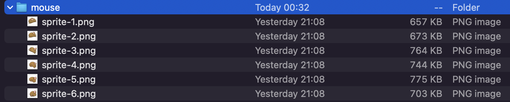
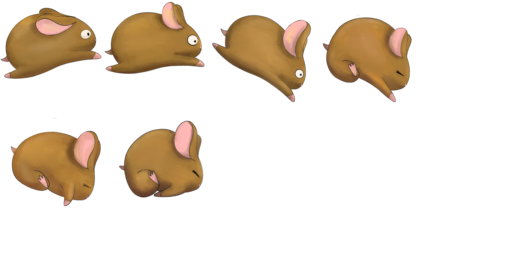

# Sprite Sheete generator v1.0

### A simple sprite sheet generator will create png while preserving the opacity layer.

####
inform the directory containing the images for creating the sprite sheet, it will be sorted in alphabetical order, ensure that this rule exists in the file name

#### options

| Parameter | type   | default | Action | required |
|-----------|--------|---------|--------|----------|
| -p        | string |         | sprites resource path | yes |
| -a        | number |  2      | Interpolation algorithm 1 - Nearest-neighbor 2 - Bilinear 3 - Bicubic 4 - Mitchell-Netravali 5 - Lanczos(2) 6 - Lanczos(3) |
| -s        | number |  1024   | Sprite sheet size |
| -0        | string |  ./spriteSheet.png | Sprite sheet size |

#### input sample

#### output sample

